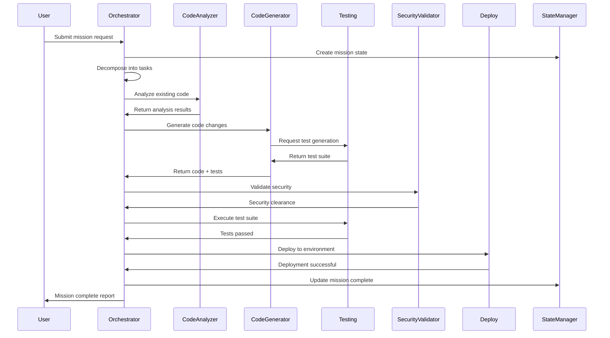

# Agent Army Pre-Design Specification v1.0
**Project**: Claude Agent Templates - Structured Agentic Workflows
**Version**: 1.0.0
**Date**: 2025-11-19
**Status**: Initial Design - Pending Red Team Review

---

## Executive Summary

This specification defines a **Hierarchical Multi-Agent System (HMAS)** for orchestrating complex software development workflows in the Microsoft Dynamics 365 Business Central / AL development ecosystem. The architecture employs specialized agents organized in a command hierarchy with distributed coordination, event-driven communication, and self-healing capabilities.

### Design Goals
1. **Modularity**: Agents are independent, containerized units with well-defined interfaces
2. **Scalability**: Dynamic agent spawning based on workload and complexity
3. **Resilience**: Fault tolerance with automatic recovery and graceful degradation
4. **Observability**: Comprehensive telemetry, tracing, and audit trails
5. **Reproducibility**: Deterministic execution with versioned state snapshots
6. **Extensibility**: Plugin architecture for custom agent types and behaviors

---

## 1. Agent Roles & Responsibilities

### 1.1 Command Tier (Strategic Layer)

#### **Orchestrator Agent** (`agent.orchestrator`)
- **Role**: Mission planning, task decomposition, resource allocation
- **Responsibilities**:
  - Parse user intent into structured mission plans
  - Decompose complex tasks into atomic work units
  - Assign work units to specialist agents based on capability matching
  - Monitor mission progress and adjust strategy dynamically
  - Handle escalations and conflict resolution
- **Capabilities**:
  - Natural language understanding (NLU) for intent extraction
  - Graph-based task dependency analysis
  - Multi-criteria decision making (MCDM) for agent selection
  - Real-time replanning with constraint satisfaction
- **Technologies**: Python 3.12+, LangGraph, Pydantic v2, asyncio
- **Inputs**: User requests, mission templates, agent capability registry
- **Outputs**: Mission plans (DAG), work unit assignments, progress reports

#### **Meta-Learning Agent** (`agent.meta`)
- **Role**: Continuous improvement through performance analysis
- **Responsibilities**:
  - Analyze mission outcomes and agent performance metrics
  - Identify patterns in failures and successes
  - Generate optimization recommendations
  - Update agent models and decision heuristics
  - Maintain knowledge graph of solution patterns
- **Capabilities**:
  - Time-series analysis for trend detection
  - Reinforcement learning for strategy optimization
  - Knowledge graph mining and reasoning
  - Automated hyperparameter tuning
- **Technologies**: Python, PyTorch/JAX, Neo4j, MLflow
- **Inputs**: Telemetry data, mission logs, performance metrics
- **Outputs**: Performance reports, updated models, optimization directives

---

### 1.2 Specialist Tier (Tactical Layer)

#### **Code Analysis Agent** (`agent.code.analyzer`)
- **Role**: Static and dynamic code analysis for AL/Business Central
- **Responsibilities**:
  - Parse AL codebase and extract semantic structures
  - Perform dependency analysis and impact assessment
  - Detect code smells, anti-patterns, and vulnerabilities
  - Generate code quality metrics and reports
- **Capabilities**:
  - AL language parsing (tree-sitter grammar)
  - Control flow graph (CFG) and data flow analysis
  - Symbol resolution and cross-reference tracking
  - Integration with AL compiler diagnostics
- **Technologies**: Rust/Python, tree-sitter, LLVM-based tooling
- **Inputs**: AL source files, symbol packages (.alpackages)
- **Outputs**: AST representations, dependency graphs, quality reports

#### **Code Generation Agent** (`agent.code.generator`)
- **Role**: Synthesize AL code from specifications and patterns
- **Responsibilities**:
  - Generate AL tables, pages, codeunits from specifications
  - Apply coding standards and style guides automatically
  - Refactor existing code with semantic preservation
  - Generate boilerplate and scaffolding structures
- **Capabilities**:
  - Template-based code generation (Jinja2/Liquid)
  - LLM-guided code synthesis with constraints
  - Syntax validation and compilation testing
  - Incremental code modification with AST transformations
- **Technologies**: Python, Anthropic Claude API, tree-sitter
- **Inputs**: Specifications (JSON/YAML), code templates, style guides
- **Outputs**: Generated AL files, modification patches, compilation reports

#### **Testing Agent** (`agent.testing`)
- **Role**: Automated test generation, execution, and validation
- **Responsibilities**:
  - Generate unit tests for AL codeunits and procedures
  - Execute test suites and collect results
  - Perform regression testing on code changes
  - Generate test coverage reports and gap analysis
- **Capabilities**:
  - AL Test Framework integration
  - Property-based test generation
  - Mutation testing for fault injection
  - Performance profiling and benchmarking
- **Technologies**: PowerShell, AL Test Runner, Docker
- **Inputs**: AL code, existing tests, coverage targets
- **Outputs**: Test results (XML), coverage reports, failure diagnostics

#### **Documentation Agent** (`agent.docs`)
- **Role**: Generate and maintain technical documentation
- **Responsibilities**:
  - Extract inline documentation from AL code comments
  - Generate API reference documentation
  - Create architectural diagrams and data models
  - Maintain changelog and release notes
- **Capabilities**:
  - Markdown/AsciiDoc generation
  - Diagram rendering (PlantUML, Mermaid)
  - Documentation versioning and diff analysis
  - Natural language summarization
- **Technologies**: Python, Sphinx/MkDocs, graphviz
- **Inputs**: AL source code, XML comments, architecture models
- **Outputs**: Documentation sites, API references, diagrams

#### **Deployment Agent** (`agent.deploy`)
- **Role**: Package, deploy, and manage AL extensions
- **Responsibilities**:
  - Compile AL projects to .app packages
  - Publish extensions to Business Central environments
  - Manage version control and rollback procedures
  - Monitor deployment health and rollback on failures
- **Capabilities**:
  - AL compiler integration (alc.exe)
  - Business Central Admin API integration
  - Blue-green deployment orchestration
  - Automated rollback with state restoration
- **Technologies**: PowerShell, Docker, Kubernetes, Azure DevOps
- **Inputs**: AL projects, deployment manifests, environment configs
- **Outputs**: .app packages, deployment logs, health reports

---

### 1.3 Validator Tier (Quality Assurance Layer)

#### **Security Validator Agent** (`agent.validator.security`)
- **Role**: Security scanning and vulnerability assessment
- **Responsibilities**:
  - Scan code for security vulnerabilities (SQL injection, XSS)
  - Validate permission assignments and data access patterns
  - Check for hardcoded secrets and credentials
  - Assess compliance with security standards (OWASP, CWE)
- **Capabilities**:
  - Static application security testing (SAST)
  - Secret scanning with regex and entropy analysis
  - Permission graph analysis
  - CVE database integration
- **Technologies**: Python, Semgrep, Bandit, TruffleHog
- **Inputs**: AL source code, permission sets, environment configs
- **Outputs**: Security reports, vulnerability assessments, remediation guides

#### **Compliance Validator Agent** (`agent.validator.compliance`)
- **Role**: Ensure adherence to coding standards and policies
- **Responsibilities**:
  - Validate code against AL coding guidelines
  - Check naming conventions and formatting standards
  - Verify license compliance and attribution
  - Enforce architectural constraints and patterns
- **Capabilities**:
  - Linting with configurable rule sets
  - License detection and SBOM generation
  - Architecture fitness functions
  - Policy-as-code enforcement
- **Technologies**: Python, CodeAL analyzer, licensee
- **Inputs**: AL code, style guides, policy definitions
- **Outputs**: Compliance reports, violation lists, fix suggestions

#### **Performance Validator Agent** (`agent.validator.performance`)
- **Role**: Performance profiling and optimization analysis
- **Responsibilities**:
  - Profile code execution and identify bottlenecks
  - Analyze database query performance
  - Detect performance anti-patterns (N+1 queries, excessive loops)
  - Generate performance optimization recommendations
- **Capabilities**:
  - AL profiling and trace analysis
  - Query execution plan analysis
  - Complexity analysis (cyclomatic, cognitive)
  - Benchmarking and regression detection
- **Technologies**: PowerShell, SQL Server Profiler, custom metrics
- **Inputs**: AL code, execution traces, benchmark baselines
- **Outputs**: Performance reports, optimization recommendations, flame graphs

---

### 1.4 Infrastructure Tier (Support Layer)

#### **Message Bus Agent** (`agent.infra.messagebus`)
- **Role**: Inter-agent communication and event routing
- **Responsibilities**:
  - Route messages between agents using pub/sub patterns
  - Manage message queues and ensure delivery guarantees
  - Handle message serialization and deserialization
  - Provide dead-letter queue for failed messages
- **Capabilities**:
  - AMQP/MQTT protocol support
  - Message persistence and replay
  - Topic-based routing with wildcards
  - Message transformation and enrichment
- **Technologies**: RabbitMQ, Redis Streams, Protocol Buffers
- **Inputs**: Agent messages, routing configurations
- **Outputs**: Delivered messages, delivery confirmations, metrics

#### **State Manager Agent** (`agent.infra.state`)
- **Role**: Distributed state management and persistence
- **Responsibilities**:
  - Maintain mission state and agent context
  - Provide transactional updates with ACID guarantees
  - Create snapshots for rollback and recovery
  - Synchronize state across distributed agents
- **Capabilities**:
  - Event sourcing with CQRS pattern
  - Distributed consensus (Raft/Paxos)
  - State versioning and time-travel queries
  - Conflict resolution with CRDTs
- **Technologies**: PostgreSQL, etcd, Redis
- **Inputs**: State update events, snapshot requests
- **Outputs**: Current state, state snapshots, change logs

#### **Observability Agent** (`agent.infra.observability`)
- **Role**: Metrics collection, logging, and distributed tracing
- **Responsibilities**:
  - Collect metrics from all agents (latency, throughput, errors)
  - Aggregate logs with structured formatting
  - Trace request flows across agent boundaries
  - Generate dashboards and alerting rules
- **Capabilities**:
  - OpenTelemetry instrumentation
  - Log aggregation and parsing
  - Anomaly detection and alerting
  - Root cause analysis with trace correlation
- **Technologies**: Prometheus, Grafana, Loki, Jaeger
- **Inputs**: Agent telemetry, log streams, trace spans
- **Outputs**: Metrics dashboards, alerts, trace visualizations

---

## 2. Workflows & Interaction Patterns

### 2.1 Mission Execution Workflow



### 2.2 Event-Driven Communication Pattern

All agents communicate via **asynchronous message passing** through the Message Bus:

1. **Command Events**: Direct agent to perform action (e.g., `code.analyze.requested`)
2. **Domain Events**: Notify state changes (e.g., `code.generated`, `tests.passed`)
3. **Query Events**: Request information (e.g., `state.query`, `metrics.fetch`)
4. **Integration Events**: External system notifications (e.g., `github.pr.created`)

**Message Schema** (Protocol Buffers):
```protobuf
message AgentMessage {
  string id = 1;                    // Unique message ID (UUID)
  string correlation_id = 2;        // Mission/request correlation
  string source_agent = 3;          // Sender agent ID
  string target_agent = 4;          // Recipient agent ID (or topic)
  MessageType type = 5;             // COMMAND, EVENT, QUERY, RESPONSE
  google.protobuf.Timestamp timestamp = 6;
  map<string, string> metadata = 7; // Headers and context
  google.protobuf.Any payload = 8;  // Type-specific payload
  int32 retry_count = 9;            // Delivery attempt count
}
```

### 2.3 Fault Tolerance & Self-Healing

**Failure Detection**:
- Heartbeat monitoring (30s intervals)
- Health check endpoints (HTTP/gRPC)
- Circuit breaker pattern for dependencies
- Timeout policies per agent type

**Recovery Strategies**:
1. **Retry with Exponential Backoff**: Transient failures (network, rate limits)
2. **Graceful Degradation**: Skip non-critical agents, warn user
3. **Compensating Transactions**: Rollback state changes on failure
4. **Agent Restart**: Terminate and spawn new instance with state restoration
5. **Manual Escalation**: Human-in-the-loop for unresolvable failures

**Example Recovery Flow**:
```
Testing Agent Fails → Circuit Breaker Opens → Retry 3x →
Still Failing → Graceful Degradation (skip tests, warn) →
Log Incident → Meta-Learning Agent Analyzes →
Generate Fix Recommendation
```

---

## 3. Technology Stack

### 3.1 Core Technologies

| Component | Technology | Rationale |
|-----------|-----------|-----------|
| **Orchestration** | Python 3.12 + LangGraph | Mature graph-based agent orchestration |
| **Agent Runtime** | Docker + Kubernetes | Containerization for isolation and scaling |
| **Message Bus** | RabbitMQ + Redis Streams | Reliable pub/sub with persistence |
| **State Store** | PostgreSQL + etcd | Transactional state + distributed config |
| **Caching** | Redis | Fast in-memory state for hot paths |
| **Observability** | OpenTelemetry + Prometheus + Grafana | Industry-standard telemetry stack |
| **Logging** | Loki + Promtail | Centralized log aggregation |
| **Tracing** | Jaeger | Distributed tracing for request flows |
| **API Gateway** | Kong + gRPC | HTTP/gRPC API management |
| **CI/CD** | GitHub Actions + ArgoCD | Automated testing and deployment |
| **IaC** | Terraform + Helm | Infrastructure as code |
| **Secrets Management** | Vault | Secure credential storage |

### 3.2 AL/Business Central Specific

| Component | Technology | Purpose |
|-----------|-----------|---------|
| **AL Compiler** | alc.exe (BC container) | Compile AL to .app packages |
| **AL Language Server** | Microsoft AL Language | IntelliSense and diagnostics |
| **BC Admin API** | REST API | Environment management |
| **AL Test Runner** | PowerShell + Docker | Execute AL tests |
| **Symbol Packages** | .alpackages/ | Dependency resolution |

---

## 4. Data Models & Schemas

### 4.1 Mission Definition

```yaml
apiVersion: agent.army/v1
kind: Mission
metadata:
  id: mission-uuid-12345
  name: "Implement Customer Credit Check"
  created_at: "2025-11-19T10:30:00Z"
  owner: "user@example.com"
spec:
  description: "Add credit limit validation to sales order processing"
  priority: high
  deadline: "2025-11-22T17:00:00Z"
  constraints:
    - max_duration: 3600s
    - required_agents: [code.analyzer, code.generator, testing]
    - approval_required: true
  tasks:
    - id: task-001
      type: code.analysis
      target_agent: agent.code.analyzer
      inputs:
        files: ["src/Sales/*.al"]
      dependencies: []
    - id: task-002
      type: code.generation
      target_agent: agent.code.generator
      inputs:
        specification: "specs/credit-check.yaml"
      dependencies: [task-001]
    - id: task-003
      type: testing
      target_agent: agent.testing
      inputs:
        coverage_target: 0.85
      dependencies: [task-002]
status:
  state: in_progress
  progress: 0.45
  current_task: task-002
  started_at: "2025-11-19T10:31:00Z"
  events:
    - timestamp: "2025-11-19T10:31:00Z"
      type: task.started
      task_id: task-001
    - timestamp: "2025-11-19T10:32:30Z"
      type: task.completed
      task_id: task-001
```

### 4.2 Agent Capability Registry

```json
{
  "agent_id": "agent.code.generator",
  "version": "1.2.0",
  "capabilities": [
    {
      "name": "generate_al_table",
      "description": "Generate AL table definition from schema",
      "inputs": {
        "schema": "object",
        "naming_convention": "string"
      },
      "outputs": {
        "al_code": "string",
        "compilation_status": "boolean"
      },
      "constraints": {
        "max_fields": 500,
        "timeout": "60s"
      }
    }
  ],
  "performance_metrics": {
    "avg_latency_ms": 1250,
    "success_rate": 0.97,
    "throughput_per_hour": 120
  },
  "dependencies": [
    "anthropic.claude-api",
    "tree-sitter-al"
  ],
  "resource_requirements": {
    "cpu": "500m",
    "memory": "1Gi",
    "gpu": false
  }
}
```

---

## 5. Risks & Mitigation Strategies

### 5.1 Technical Risks

| Risk | Likelihood | Impact | Mitigation |
|------|-----------|--------|-----------|
| **Agent Deadlock** | Medium | High | Implement timeout policies; DAG validation prevents cycles |
| **State Inconsistency** | Medium | High | Event sourcing with CQRS; distributed transactions with 2PC |
| **Message Loss** | Low | High | Persistent queues; delivery confirmations; idempotent handlers |
| **LLM Hallucination** | High | Medium | Validation agents; compilation testing; human approval gates |
| **Resource Exhaustion** | Medium | High | Rate limiting; agent quotas; auto-scaling with limits |
| **Security Breach** | Low | Critical | Principle of least privilege; secret scanning; network segmentation |

### 5.2 Operational Risks

| Risk | Likelihood | Impact | Mitigation |
|------|-----------|--------|-----------|
| **Agent Version Skew** | Medium | Medium | Semantic versioning; capability negotiation; backward compatibility |
| **Deployment Failure** | Medium | High | Blue-green deployments; automated rollback; canary releases |
| **Data Loss** | Low | Critical | Regular backups; replication; point-in-time recovery |
| **Monitoring Blind Spots** | High | Medium | Comprehensive instrumentation; synthetic monitoring; SLO tracking |
| **Runaway Costs** | Medium | High | Budget alerts; cost attribution per mission; auto-shutdown policies |

### 5.3 Business Risks

| Risk | Likelihood | Impact | Mitigation |
|------|-----------|--------|-----------|
| **User Trust Erosion** | Medium | High | Transparent logging; explainability features; human oversight |
| **Regulatory Non-Compliance** | Low | Critical | Compliance validation agent; audit trails; GDPR/SOC2 controls |
| **Vendor Lock-in** | Medium | Medium | Open standards; abstraction layers; multi-cloud support |

---

## 6. Assumptions

### 6.1 Technical Assumptions
1. **Infrastructure**: Kubernetes cluster available with 10+ nodes and 100GB+ storage
2. **Network**: Agents can communicate with <50ms latency within cluster
3. **AL Compiler**: Microsoft AL compiler accessible via Docker containers
4. **API Access**: Valid credentials for Anthropic Claude API with sufficient quota
5. **Business Central**: Access to BC sandbox/dev environments for testing
6. **Persistence**: PostgreSQL 15+ with ACID guarantees and replication
7. **Message Broker**: RabbitMQ with 99.9% availability SLA

### 6.2 Operational Assumptions
1. **Expertise**: Team has Kubernetes, Python, and AL development expertise
2. **CI/CD**: GitHub Actions or equivalent pipeline infrastructure exists
3. **Monitoring**: 24/7 monitoring and on-call rotation in place
4. **Secrets**: Vault or equivalent secrets management solution deployed
5. **Budget**: Cloud infrastructure budget for 5-10 medium-sized instances

### 6.3 Business Assumptions
1. **Scope**: Primary focus on Dynamics 365 Business Central AL development
2. **Users**: Internal development teams, not external customers initially
3. **Scale**: Supporting 10-100 concurrent missions initially
4. **Latency**: Mission completion times of minutes to hours acceptable
5. **Approval**: Human approval required for production deployments

---

## 7. Success Metrics

### 7.1 Performance Metrics
- **Mission Completion Rate**: >95% of missions complete successfully
- **Mean Time to Complete (MTTC)**: <30 minutes for standard development tasks
- **Agent Availability**: >99.5% uptime per agent type
- **End-to-End Latency**: P95 <5 minutes for code generation tasks
- **Resource Utilization**: <70% average CPU/memory across cluster

### 7.2 Quality Metrics
- **Code Quality**: >90% automated test coverage on generated code
- **Security**: Zero critical vulnerabilities in generated code
- **Compliance**: 100% adherence to AL coding standards
- **Reliability**: <1% false positive rate in validation agents

### 7.3 Business Metrics
- **Developer Productivity**: 2x increase in feature delivery velocity
- **Time Saved**: 40% reduction in manual coding/testing time
- **Cost Efficiency**: 30% reduction in development costs
- **User Satisfaction**: >4.5/5 rating from development teams

---

## 8. Implementation Phases

### Phase 1: Foundation (Weeks 1-3)
- Set up infrastructure (Kubernetes, databases, message bus)
- Implement Orchestrator Agent with basic task decomposition
- Implement State Manager and Message Bus agents
- Deploy observability stack (Prometheus, Grafana, Jaeger)
- Create CI/CD pipeline for agent deployment

### Phase 2: Core Specialists (Weeks 4-6)
- Implement Code Analysis Agent with AL parsing
- Implement Code Generation Agent with Claude API integration
- Implement Testing Agent with AL Test Framework
- Create agent capability registry and discovery
- Integration testing of multi-agent workflows

### Phase 3: Validators (Weeks 7-8)
- Implement Security Validator Agent
- Implement Compliance Validator Agent
- Implement Performance Validator Agent
- Create validation rule sets and policies
- End-to-end workflow testing

### Phase 4: Advanced Features (Weeks 9-10)
- Implement Meta-Learning Agent with performance analysis
- Add dynamic agent scaling based on load
- Implement advanced fault tolerance (circuit breakers, retries)
- Create knowledge graph for solution patterns
- Pilot with selected development teams

### Phase 5: Production Hardening (Weeks 11-12)
- Security audit and penetration testing
- Load testing and performance optimization
- Disaster recovery procedures and runbooks
- Documentation and training materials
- General availability release

---

## 9. Open Questions for Red Team Review

1. **Scalability**: Can this architecture handle 1000+ concurrent missions? What are bottlenecks?
2. **Security**: Are there privilege escalation risks in agent-to-agent communication?
3. **Reliability**: What happens if the Orchestrator Agent fails during mission execution?
4. **Cost**: What is the estimated cloud infrastructure cost at 100 missions/day?
5. **Complexity**: Is the agent hierarchy too complex for initial implementation?
6. **Vendor Lock-in**: How dependent are we on Anthropic Claude API? What's the migration path?
7. **Data Residency**: How do we ensure compliance with data residency requirements?
8. **Testing**: How do we test the agent army itself? Meta-testing strategies?
9. **Observability**: Can we detect subtle degradation before it impacts users?
10. **Evolution**: How do we update agents without breaking in-flight missions?

---

## Appendix A: Glossary

- **Mission**: High-level user request decomposed into tasks
- **Task**: Atomic unit of work assigned to a single agent
- **Agent Capability**: Well-defined function an agent can perform
- **Event Sourcing**: Pattern where state changes are stored as events
- **CQRS**: Command Query Responsibility Segregation pattern
- **Circuit Breaker**: Pattern to prevent cascading failures
- **Blue-Green Deployment**: Zero-downtime deployment strategy
- **HMAS**: Hierarchical Multi-Agent System

---

## Appendix B: References

1. [LangGraph Documentation](https://langchain-ai.github.io/langgraph/)
2. [Microsoft AL Language Reference](https://learn.microsoft.com/en-us/dynamics365/business-central/dev-itpro/developer/devenv-reference-overview)
3. [OpenTelemetry Specification](https://opentelemetry.io/docs/specs/)
4. [RabbitMQ Best Practices](https://www.rabbitmq.com/documentation.html)
5. [Event Sourcing Pattern](https://martinfowler.com/eaaDev/EventSourcing.html)

---

**End of Pre-Design Specification v1.0**
